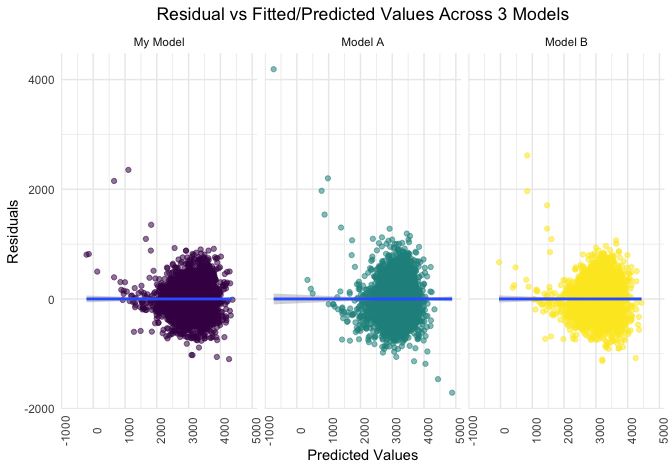
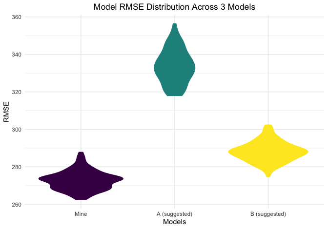

P8105 HW6
================
Brian Jo Hsuan Lee
2021-12-01

Load libraries

``` r
library(tidyverse)
library(modelr)
library(patchwork)
setwd("~/Desktop/Columbia/Fall_2021/P8105-Data_Science/HW/p8105_hw6_jl6046/")
```

Set knitr options

``` r
knitr::opts_chunk$set(
  fig.width = 7,
  fig.asp = .7,
  out.width = "90%"
)

theme_set(theme_minimal() + theme(legend.position = "bottom"))

options(
  ggplot2.continuous.colour = "viridis",
  ggplot2.continuous.fill = "viridis"
)

scale_colour_discrete = scale_colour_viridis_d
scale_fill_discrete = scale_fill_viridis_d
```

Import .csv and convert columns

``` r
bw_df = 
  read_csv("./data/birthweight.csv") %>% 
  mutate(
    babysex = recode_factor(babysex, `2` = "F", `1` = "M"),
    # babysex = factor(babysex, levels = c("F", "M")),
    frace = recode_factor(frace, `1` = "White", `2` = "Black", `3` = "Asian", `4` = "Puerto Rico", `8` = "Other", `9` = "Unknown"),
    malform = recode_factor(malform, `0` = "Absent", `1` = "Present"),
    mrace = recode_factor(mrace, `1` = "White", `2` = "Black", `3` = "Asian", `4` = "Puerto Rico", `8` = "Other")
  )
```

Develop a robust model. I decided to use the step-wise regression for
the predictor selection process, as it optimizes my model based on AIC.

``` r
my_fit = 
  lm(bwt ~ ., data = bw_df) %>% 
  step(direction = 'both')
```

    ## Start:  AIC=48717.83
    ## bwt ~ babysex + bhead + blength + delwt + fincome + frace + gaweeks + 
    ##     malform + menarche + mheight + momage + mrace + parity + 
    ##     pnumlbw + pnumsga + ppbmi + ppwt + smoken + wtgain
    ## 
    ## 
    ## Step:  AIC=48717.83
    ## bwt ~ babysex + bhead + blength + delwt + fincome + frace + gaweeks + 
    ##     malform + menarche + mheight + momage + mrace + parity + 
    ##     pnumlbw + pnumsga + ppbmi + ppwt + smoken
    ## 
    ## 
    ## Step:  AIC=48717.83
    ## bwt ~ babysex + bhead + blength + delwt + fincome + frace + gaweeks + 
    ##     malform + menarche + mheight + momage + mrace + parity + 
    ##     pnumlbw + ppbmi + ppwt + smoken
    ## 
    ## 
    ## Step:  AIC=48717.83
    ## bwt ~ babysex + bhead + blength + delwt + fincome + frace + gaweeks + 
    ##     malform + menarche + mheight + momage + mrace + parity + 
    ##     ppbmi + ppwt + smoken
    ## 
    ##            Df Sum of Sq       RSS   AIC
    ## - frace     4    124365 320848704 48712
    ## - malform   1      1419 320725757 48716
    ## - ppbmi     1      6346 320730684 48716
    ## - momage    1     28661 320752999 48716
    ## - mheight   1     66886 320791224 48717
    ## - menarche  1    111679 320836018 48717
    ## - ppwt      1    131132 320855470 48718
    ## <none>                  320724338 48718
    ## - fincome   1    193454 320917792 48718
    ## - parity    1    413584 321137922 48721
    ## - mrace     3    868321 321592659 48724
    ## - babysex   1    853796 321578134 48727
    ## - gaweeks   1   4611823 325336161 48778
    ## - smoken    1   5076393 325800732 48784
    ## - delwt     1   8008891 328733230 48823
    ## - blength   1 102050296 422774634 49915
    ## - bhead     1 106535716 427260054 49961
    ## 
    ## Step:  AIC=48711.51
    ## bwt ~ babysex + bhead + blength + delwt + fincome + gaweeks + 
    ##     malform + menarche + mheight + momage + mrace + parity + 
    ##     ppbmi + ppwt + smoken
    ## 
    ##            Df Sum of Sq       RSS   AIC
    ## - malform   1      1447 320850151 48710
    ## - ppbmi     1      6975 320855679 48710
    ## - momage    1     28379 320877083 48710
    ## - mheight   1     69502 320918206 48710
    ## - menarche  1    115708 320964411 48711
    ## - ppwt      1    133961 320982665 48711
    ## <none>                  320848704 48712
    ## - fincome   1    194405 321043108 48712
    ## - parity    1    414687 321263390 48715
    ## + frace     4    124365 320724338 48718
    ## - babysex   1    852133 321700837 48721
    ## - gaweeks   1   4625208 325473911 48772
    ## - smoken    1   5036389 325885093 48777
    ## - delwt     1   8013099 328861802 48817
    ## - mrace     3  13540415 334389119 48885
    ## - blength   1 101995688 422844392 49908
    ## - bhead     1 106662962 427511666 49956
    ## 
    ## Step:  AIC=48709.53
    ## bwt ~ babysex + bhead + blength + delwt + fincome + gaweeks + 
    ##     menarche + mheight + momage + mrace + parity + ppbmi + ppwt + 
    ##     smoken
    ## 
    ##            Df Sum of Sq       RSS   AIC
    ## - ppbmi     1      6928 320857079 48708
    ## - momage    1     28660 320878811 48708
    ## - mheight   1     69320 320919470 48708
    ## - menarche  1    116027 320966177 48709
    ## - ppwt      1    133894 320984044 48709
    ## <none>                  320850151 48710
    ## - fincome   1    193784 321043934 48710
    ## + malform   1      1447 320848704 48712
    ## - parity    1    414482 321264633 48713
    ## + frace     4    124393 320725757 48716
    ## - babysex   1    851279 321701430 48719
    ## - gaweeks   1   4624003 325474154 48770
    ## - smoken    1   5035195 325885346 48775
    ## - delwt     1   8029079 328879230 48815
    ## - mrace     3  13553320 334403471 48883
    ## - blength   1 102009225 422859375 49906
    ## - bhead     1 106675331 427525481 49954
    ## 
    ## Step:  AIC=48707.63
    ## bwt ~ babysex + bhead + blength + delwt + fincome + gaweeks + 
    ##     menarche + mheight + momage + mrace + parity + ppwt + smoken
    ## 
    ##            Df Sum of Sq       RSS   AIC
    ## - momage    1     29211 320886290 48706
    ## - menarche  1    117635 320974714 48707
    ## <none>                  320857079 48708
    ## - fincome   1    195199 321052278 48708
    ## + ppbmi     1      6928 320850151 48710
    ## + malform   1      1400 320855679 48710
    ## - parity    1    412984 321270064 48711
    ## + frace     4    125020 320732060 48714
    ## - babysex   1    850020 321707099 48717
    ## - mheight   1   1078673 321935752 48720
    ## - ppwt      1   2934023 323791103 48745
    ## - gaweeks   1   4621504 325478583 48768
    ## - smoken    1   5039368 325896447 48773
    ## - delwt     1   8024939 328882018 48813
    ## - mrace     3  13551444 334408523 48881
    ## - blength   1 102018559 422875638 49904
    ## - bhead     1 106821342 427678421 49953
    ## 
    ## Step:  AIC=48706.02
    ## bwt ~ babysex + bhead + blength + delwt + fincome + gaweeks + 
    ##     menarche + mheight + mrace + parity + ppwt + smoken
    ## 
    ##            Df Sum of Sq       RSS   AIC
    ## - menarche  1    100121 320986412 48705
    ## <none>                  320886290 48706
    ## - fincome   1    240800 321127090 48707
    ## + momage    1     29211 320857079 48708
    ## + ppbmi     1      7479 320878811 48708
    ## + malform   1      1678 320884612 48708
    ## - parity    1    431433 321317724 48710
    ## + frace     4    124743 320761547 48712
    ## - babysex   1    841278 321727568 48715
    ## - mheight   1   1076739 321963029 48719
    ## - ppwt      1   2913653 323799943 48743
    ## - gaweeks   1   4676469 325562760 48767
    ## - smoken    1   5045104 325931394 48772
    ## - delwt     1   8000672 328886962 48811
    ## - mrace     3  14667730 335554021 48894
    ## - blength   1 101990556 422876847 49902
    ## - bhead     1 106864308 427750598 49952
    ## 
    ## Step:  AIC=48705.38
    ## bwt ~ babysex + bhead + blength + delwt + fincome + gaweeks + 
    ##     mheight + mrace + parity + ppwt + smoken
    ## 
    ##            Df Sum of Sq       RSS   AIC
    ## <none>                  320986412 48705
    ## + menarche  1    100121 320886290 48706
    ## - fincome   1    245637 321232048 48707
    ## + momage    1     11698 320974714 48707
    ## + ppbmi     1      8823 320977589 48707
    ## + malform   1      1884 320984528 48707
    ## - parity    1    422770 321409181 48709
    ## + frace     4    128726 320857686 48712
    ## - babysex   1    846134 321832545 48715
    ## - mheight   1   1012240 321998651 48717
    ## - ppwt      1   2907049 323893461 48743
    ## - gaweeks   1   4662501 325648912 48766
    ## - smoken    1   5073849 326060260 48771
    ## - delwt     1   8137459 329123871 48812
    ## - mrace     3  14683609 335670021 48894
    ## - blength   1 102191779 423178191 49903
    ## - bhead     1 106779754 427766166 49950

Introduce the 2 suggested models

``` r
fit_1 = 
  lm(bwt ~ blength + gaweeks, data = bw_df)
fit_2 = 
  lm(bwt ~ babysex * bhead + babysex * blength + bhead * blength + babysex * bhead * blength, data = bw_df)
```

Compare the 3 models using residuals vs fitted/predicted values plots.
Not I included an extra plot of the same nature with regression lines
plotted for extra information on the goodness of fit.

``` r
bw_df %>% 
  modelr::add_predictions(my_fit) %>% 
  modelr::add_residuals(my_fit) %>%
  mutate(
    model = factor("my_model", labels = "My Model")
  ) %>% 
  bind_rows(
    bw_df %>% 
      modelr::add_predictions(fit_1) %>% 
      modelr::add_residuals(fit_1) %>% 
      mutate(
        model = factor("model_1", labels = "Model A")
      )
  ) %>% 
  bind_rows(
    bw_df %>% 
      modelr::add_predictions(fit_2) %>% 
      modelr::add_residuals(fit_2) %>% 
      mutate(
        model = factor("model_2", labels = "Model B")
      )
  ) %>% 
  ggplot(aes(x = pred, y = resid, color = model, alpha = 0.5)) +
  geom_point() +
  labs(
    title = "Residual vs Fitted/Predicted Values Across 3 Models",
    x = "Predicted Values",
    y = "Residuals"
  ) +
  theme(
    axis.text.x = element_text(angle = 90),
    plot.title = element_text(hjust = 0.5),
    legend.position = "none"
  ) + 
  facet_wrap(~model)
```



``` r
par(mfrow=c(1,3))
my_plot = plot(my_fit, which = 1)
plot_a = plot(fit_1, which = 1)
plot_b = plot(fit_2, which = 1)
```


Cross-validation

``` r
all_fit_df = 
  bw_df %>% 
  gather_predictions(my_fit, fit_1, fit_2) %>% 
  left_join(
    bw_df %>% 
      gather_residuals(my_fit, fit_1, fit_2)
  ) %>% 
  mutate(model = fct_inorder(model)) 


cv_df = 
  crossv_mc(all_fit_df, 100) %>% 
  mutate(
    my_model  = map(train, ~my_fit),
    model_a  = map(train, ~fit_1),
    model_b  = map(train, ~fit_2),
    rmse_my_model = map2_dbl(my_model, test, ~rmse(model = .x, data = .y)),
    rmse_model_a = map2_dbl(model_a, test, ~rmse(model = .x, data = .y)),
    rmse_model_b = map2_dbl(model_b, test, ~rmse(model = .x, data = .y))
  ) %>% 
  select(starts_with("rmse")) %>% 
  pivot_longer(
    everything(),
    names_to = "model", 
    values_to = "rmse",
    names_prefix = "rmse_") %>% 
  mutate(model = fct_inorder(model))

SoilSciGuylabs = c("Mine", "A (suggested)", "B (suggested)")

cv_df %>% 
  ggplot(aes(x = model, y = rmse, fill = model, color = model)) + 
  geom_violin() +
  labs(
    title = "Model RMSE Distribution Across 3 Models",
    x = "Models",
    y = "RMSE"
  ) +
  scale_x_discrete(labels= SoilSciGuylabs) +
  theme(
    plot.title = element_text(hjust = 0.5),
    legend.position = "none"
  )
```


